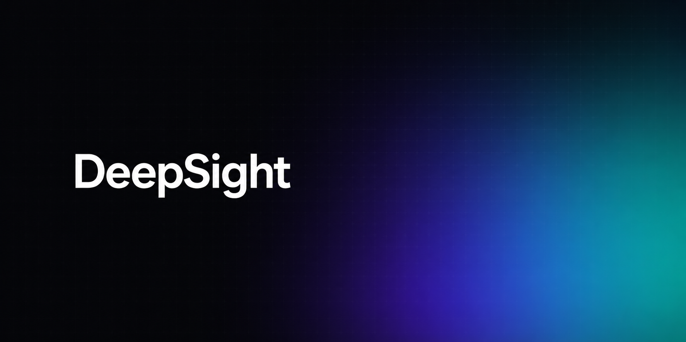
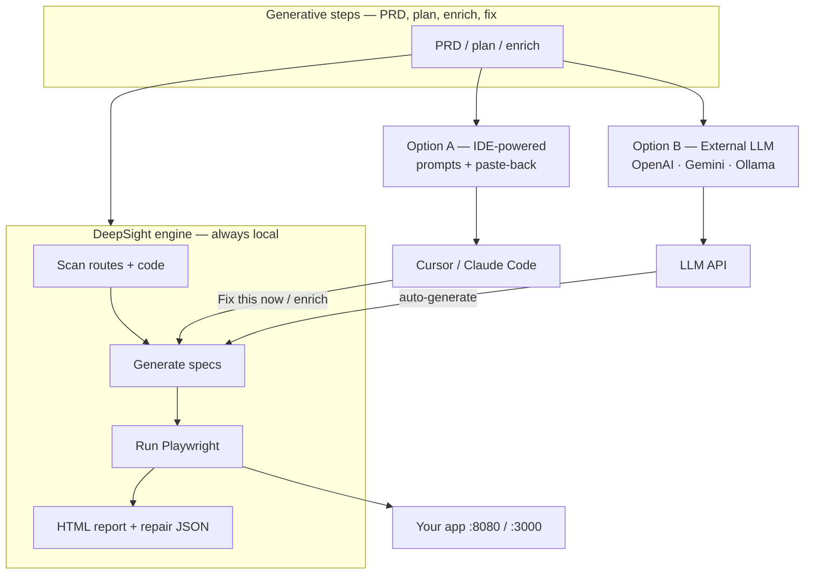
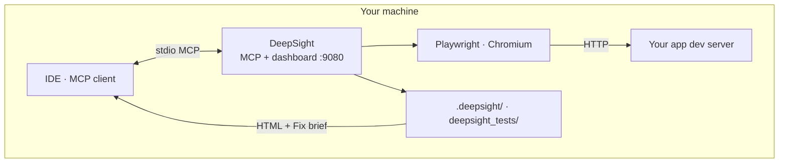
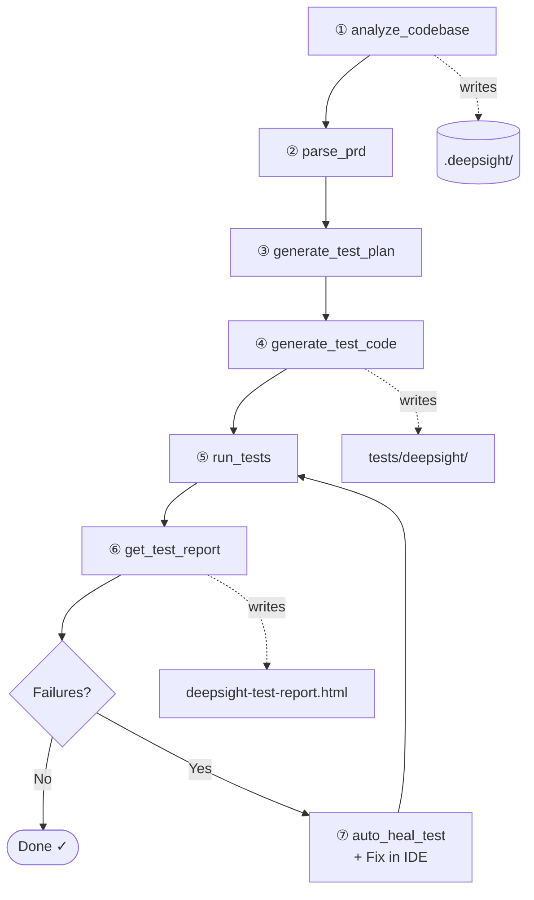

<p align="center">
  
</p>

# DeepSight

**Turn your JavaScript/TypeScript app into Playwright tests — from your IDE, on your machine.**

DeepSight is a local-first [MCP](https://modelcontextprotocol.io/) server that scans your repo, builds a test plan, generates Playwright specs, runs them against your dev server, and returns HTML reports plus repair briefs for Cursor or Claude Code. **Your codebase never uploads to a DeepSight cloud.**

<p align="center">
  <a href="https://github.com/Dukeabaddon/DeepSight/blob/main/LICENSE"></a>
  <a href="https://github.com/Dukeabaddon/DeepSight/stargazers"></a>
  <a href="https://nodejs.org/"></a>
  
  
  
  
</p>

<p align="center">
  <a href="#-choose-your-ai-mode">Choose AI mode</a> ·
  <a href="#-quick-start-dashboard">Get started</a> ·
  <a href="#-how-it-works">How it works</a> ·
  <a href="#-mcp-tools">MCP tools</a> ·
  <a href="#-configuration">Configuration</a> ·
  <a href="https://github.com/Dukeabaddon/DeepSight/issues">Issues</a>
</p>

> **Preview (0.1.0-alpha)** — Core loop works end-to-end. First runs often fail until port/specs are aligned; smoke tests are shallow until you enrich in your IDE. See [Alpha limitations](#-alpha-limitations).

---

## Why DeepSight?

| Pain | DeepSight |
|------|-----------|
| Empty `e2e/` folder, no time to write tests | Scaffolds route-aware Playwright specs from your router + code |
| AI writes one-off tests that don't match your app | Analysis pass links plans to **your** routes and entities |
| Cloud testers need repo access / CI wiring | Runs **locally** against `localhost` — you control secrets and data |
| Failures with no actionable next step | HTML report + **Fix this now** clipboard brief for your IDE |

**Works with:** React (Vite, CRA), Next.js App/Pages Router, Vue/Svelte via Vite, Node API projects (smoke). Deeper backend/API generation is on the roadmap.

---

## Choose your AI mode

DeepSight always runs **locally** (scan, Playwright, reports). The **generative** steps — richer PRDs, test plans, spec enrichment, repair — can be powered in two ways. **Pick one when you install / wire MCP** (you can switch later by adding or removing env vars).



### Option A — IDE-powered *(default, recommended)*

**Who does the “AI” work?** Cursor, Claude Code, or another MCP client **you already use**.

| | |
|---|---|
| **Setup** | MCP config only — **no DeepSight API key** |
| **Flow** | Tools emit JSON/YAML artifacts + instruction prompts → you (or your agent) read, edit, and re-run |
| **Best for** | Day-to-day dev, rich tests, “Fix this now” paste-back, human review |
| **Dashboard** | Run DeepSight → open HTML report → **Fix this now** → paste into IDE chat |

DeepSight is the **engine**; your IDE’s model is the **author**.

### Option B — External LLM *(API key / local model)*

**Who does the “AI” work?** A model DeepSight calls **directly** during tool execution.

| | |
|---|---|
| **Setup** | Set `DEEPSIGHT_LLM_*` env vars **before** starting the MCP server (see below) |
| **Providers** | OpenAI · Google Gemini · Ollama (local) |
| **Flow** | Same pipeline tools; when LLM is configured, summary/PRD/plan steps auto-generate instead of returning IDE instructions |
| **Best for** | Headless runs, scripts, or when you don’t want to hand prompts back to the IDE |

```json
{
  "mcpServers": {
    "deepsight": {
      "command": "node",
      "args": ["/absolute/path/to/DeepSight/dist/index.js"],
      "env": {
        "DEEPSIGHT_BASE_URL": "http://localhost:8080",
        "DEEPSIGHT_LLM_PROVIDER": "openai",
        "DEEPSIGHT_LLM_API_KEY": "your-key-here",
        "DEEPSIGHT_LLM_MODEL": "gpt-4o-mini"
      }
    }
  }
}
```

Ollama example: `DEEPSIGHT_LLM_PROVIDER=ollama`, `DEEPSIGHT_LLM_BASE_URL=http://localhost:11434`, model e.g. `qwen2.5-coder`.

### Verify which mode is active

Call MCP tool **`deepsight_check_info`** (or ask your agent). Response includes:

- `optionA` — IDE assistant mode (always available)
- `optionB` — `LLM (provider) — configured` or `LLM — not configured`
- `llmConfigured` — `true` / `false`

### First-time project initialization

Before the pipeline runs on an app, DeepSight needs a **target project path** and **local URL**:

| Entry point | What it does |
|-------------|----------------|
| **Web dashboard** | Sets `.deepsight/config.json` (port, frontend/backend/both) on **Run DeepSight** |
| **`deepsight_bootstrap`** (MCP) | Legacy first-time setup: folders + config — skip if config already exists |
| **`analyze_codebase`** (MCP) | Modern path: scan + `.deepsight/analysis.db` without separate bootstrap |

**Option A typical path:** dashboard or `analyze_codebase` → run tests → **Fix this now** / IDE enrich prompt in Cursor.

**Option B typical path:** set LLM env → MCP pipeline end-to-end with less manual paste-back.

---

## How it works

Everything runs on **your machine** — no DeepSight cloud:



### MCP pipeline (tool order)

Deterministic steps DeepSight runs locally. Generative steps (PRD, plan) use [Option A or B](#-choose-your-ai-mode).



| Step | Tool | Output |
|------|------|--------|
| ① | `analyze_codebase` | Routes, entities, import graph |
| ② | `parse_prd` | Normalized PRD (optional `PRD.md`) |
| ③ | `generate_test_plan` | Prioritized test cases |
| ④ | `generate_test_code` | Playwright `.spec.ts` |
| ⑤ | `run_tests` | Requires **dev server running** |
| ⑥ | `get_test_report` | Classified failures |
| ⑦ | `auto_heal_test` | Heal proposals → re-run |

**Dashboard shortcut:** one **Run DeepSight** button runs scan → plan → smoke specs → Playwright → report (best for [Option A](#choose-your-ai-mode)).

---

## Quick start (dashboard)

Best first path: one button, visual report, no MCP config.

**1. Install DeepSight**

```bash
git clone https://github.com/Dukeabaddon/DeepSight.git
cd DeepSight
npm install
npm run build
npx playwright install chromium
```

**2. Start your app** (example: Vite on port 8080)

```bash
cd /path/to/your-app
npm run dev
```

**3. Start the dashboard**

<details>
<summary><strong>macOS / Linux</strong></summary>

```bash
cd DeepSight
export DEEPSIGHT_PROJECT_PATH=/path/to/your-app
npm run web
```

</details>

<details>
<summary><strong>Windows (PowerShell)</strong></summary>

```powershell
cd DeepSight
$env:DEEPSIGHT_PROJECT_PATH = "C:\path\to\your-app"
npm run web
```

</details>

Open the URL printed in the terminal (usually `http://localhost:9080/init?project_path=...`).

**4. In the dashboard**

1. **Test type** — Frontend, Backend, or Both  
2. **App port** — match Vite/Next (e.g. `8080`, `3000`)  
3. **Run DeepSight**  
4. **Open full report (HTML)** — per-test pass/fail and error details  
5. **Fix this now** — copy a repair brief into Cursor, fix app or specs, run again  

---

## Quick start (MCP)

For Cursor, Claude Code, or any MCP client over **stdio**.

**Cursor** — add to `.cursor/mcp.json`:

```json
{
  "mcpServers": {
    "deepsight": {
      "command": "node",
      "args": ["/absolute/path/to/DeepSight/dist/index.js"],
      "env": {
        "DEEPSIGHT_BASE_URL": "http://localhost:8080"
      }
    }
  }
}
```

Restart the IDE. Example **full-loop prompt**:

```text
Use DeepSight on this project (absolute project path: /path/to/your-app).
My dev server is at http://localhost:8080.
Run: analyze_codebase → parse_prd → generate_test_plan → generate_test_code → run_tests → get_test_report.
Summarize pass/fail and suggest fixes for any environment or fragility failures.
```

**Claude Desktop** — add to `claude_desktop_config.json` under `mcpServers` with the same `command`, `args`, and `env`.

Check connection: call `deepsight_check_info` or ask the agent to list DeepSight tools.

---

## MCP tools

### Core pipeline (use these first)

| Tool | Requires | Output |
|------|----------|--------|
| `analyze_codebase` | — | Routes, entities, import graph, `.deepsight/analysis.db` |
| `parse_prd` | analyze | Normalized PRD JSON |
| `generate_test_plan` | parse_prd | Plan with priorities |
| `generate_test_code` | plan | `tests/deepsight/*.spec.ts`, `deepsight_tests/` |
| `run_tests` | specs + **dev server up** | Playwright results JSON |
| `get_test_report` | run_tests | Markdown + HTML summary, classifications |
| `auto_heal_test` | report | Heal proposals / patches |

### Dashboard & lifecycle

| Tool | Purpose |
|------|---------|
| `deepsight_open_test_result_dashboard` | Open web UI (`npm run web` equivalent) |
| `deepsight_get_lifecycle_status` | Current phase + which artifacts exist |

### Legacy / scaffold path

Older integrations use `deepsight_*` names (`deepsight_bootstrap`, `deepsight_generate_code_and_execute`, …). New projects should prefer the **core pipeline** table above.

---

## Configuration

| Variable | Default / fallback | Description |
|----------|-------------------|-------------|
| `DEEPSIGHT_PROJECT_PATH` | — | Target app root (dashboard & verify scripts) |
| `DEEPSIGHT_BASE_URL` | `.deepsight/config.json` → port heuristics | App URL, e.g. `http://localhost:8080` |
| `DEEPSIGHT_LLM_PROVIDER` | — | `openai` · `gemini` · `ollama` — enables **Option B** |
| `DEEPSIGHT_LLM_API_KEY` | — | Provider API key (Option B; keep in env only) |
| `DEEPSIGHT_LLM_MODEL` | provider default | Model id, e.g. `gpt-4o-mini`, `gemini-2.0-flash` |
| `DEEPSIGHT_LLM_BASE_URL` | — | Custom endpoint (OpenAI-compatible APIs, Ollama) |

Copy [`.env.example`](.env.example) → `.env.local`. **Never commit secrets.** Without `DEEPSIGHT_LLM_PROVIDER`, DeepSight stays on **Option A** (IDE-powered).

**Port resolution order:** `DEEPSIGHT_BASE_URL` → `.deepsight/config.json` `localEndpoint` → Vite/Next heuristics from `package.json`.

---

## Artifacts in your project

DeepSight writes into the **app under test**, not into the DeepSight install directory:

```text
your-app/
├── .deepsight/              # config, analysis DB, Playwright config copy
├── deepsight_tests/         # specs, tmp results, HTML report, repair JSON
│   ├── deepsight-test-report.html
│   └── tmp/test_results.json
└── tests/deepsight/         # CI-friendly spec copies
```

Add to **your app's** `.gitignore`:

```gitignore
deepsight_tests/
.deepsight/
tests/deepsight/
```

---

## Alpha limitations

Honest scope for **v0.1.0-alpha**:

| Area | Today | Planned |
|------|-------|---------|
| Core MCP loop + dashboard | Yes | — |
| Tree-sitter analysis + import graph | Yes | Full call graph |
| HTML report (per-test errors) | Yes | Screenshots / video |
| Auto-heal | Proposals + basic patches | DOM re-rank |
| Backend/API test generation | Smoke only | Express / Fastify / Nest |
| CI export | Manual | GitHub Action template |

**First run tips:** Match dashboard **App port** to Vite/Next output; keep dev server running before `run_tests`; expect many smoke failures until IDE enrichment — use **Fix this now** and re-run.

---

## Requirements

- **Node.js 18+**
- **Chromium** — `npx playwright install chromium` (once per machine)
- **Running dev server** when executing tests

---

## Development

```bash
npm run build              # TypeScript → dist/
npm run test:analyze       # Pipeline QA (DeepSight repo)
npm run test:live:e2e      # Full E2E on external app (see below)
npm run security:check     # Secret pattern scan
```

Live E2E against your app:

```powershell
$env:DEEPSIGHT_PROJECT_PATH = "C:\path\to\your-app"
$env:DEEPSIGHT_BASE_URL = "http://localhost:8080"
npm run test:live:e2e
```

---

## Architecture

| Layer | Technology |
|-------|------------|
| Protocol | MCP stdio ([`@modelcontextprotocol/sdk`](https://github.com/modelcontextprotocol/sdk)) |
| Validation | Zod |
| Analysis | tree-sitter (JS/TS), route scan, SQLite or JSON store |
| Execution | Playwright (`@playwright/test`) |
| Dashboard | Express 5 + `assets/init-dashboard.html` |

---

## Security & trust

- **Local-first** — analysis and test runs stay on your machine.
- **No DeepSight cloud** — we do not host your repo or test results.
- **Optional LLM** — if enabled, only the provider you configure receives prompts you send through that integration.
- Report vulnerabilities via [SECURITY.md](SECURITY.md).

---

## FAQ

**Do I need an API key?**  
No for **Option A** (default). Option B requires `DEEPSIGHT_LLM_PROVIDER` + key (or local Ollama).

**Option A vs B — which should I use?**  
Start with **Option A** if you use Cursor/Claude daily. Use **Option B** only if you want DeepSight to call OpenAI/Gemini/Ollama itself without paste-back prompts.

**Why did most tests fail on first run?**  
Usually wrong port (`5173` vs `8080`), shallow smoke specs, or dev server not running. Check HTML report categories (`environment` vs `fragility`).

**Can I use this in CI?**  
Generated specs under `tests/deepsight/` are meant for reuse; official CI templates are roadmap.

**npm install?**  
Package name: `@deepsight/deepsight-mcp`. Install from git today; npm publish coming — `npm install` after release.

---

## Roadmap

- Richer API/backend tests  
- Trace, screenshot, and video in HTML reports  
- CI workflow generator  
- Stronger auto-heal (selector re-rank)

Track progress on [GitHub Issues](https://github.com/Dukeabaddon/DeepSight/issues).

---

## Contributing

Issues and PRs welcome. Before submitting:

```bash
npm run build
npm run test:analyze
npm run security:check
```

---

## License

[MIT](LICENSE) © [Dukeabaddon](https://github.com/Dukeabaddon)
